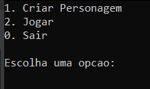
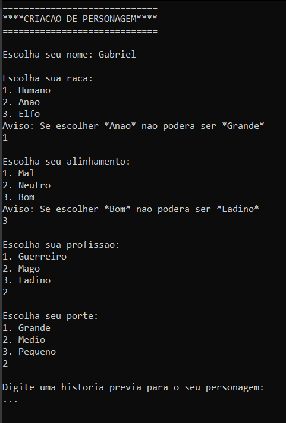
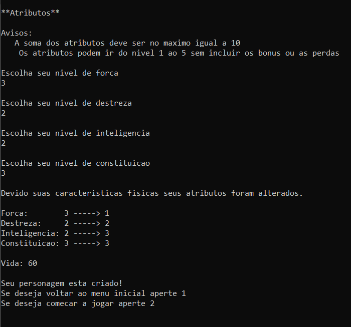
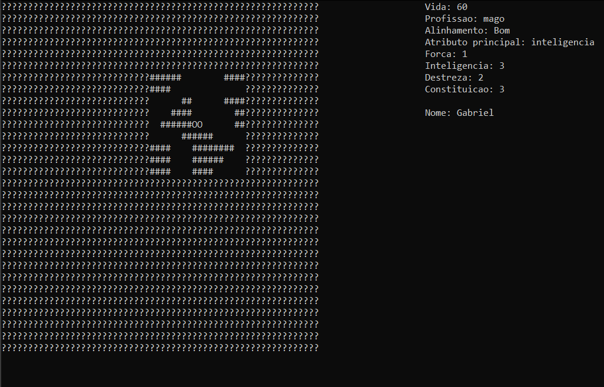
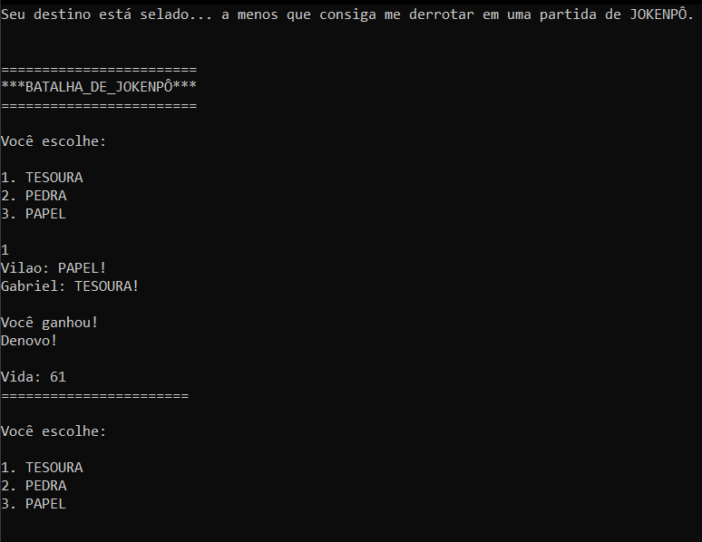
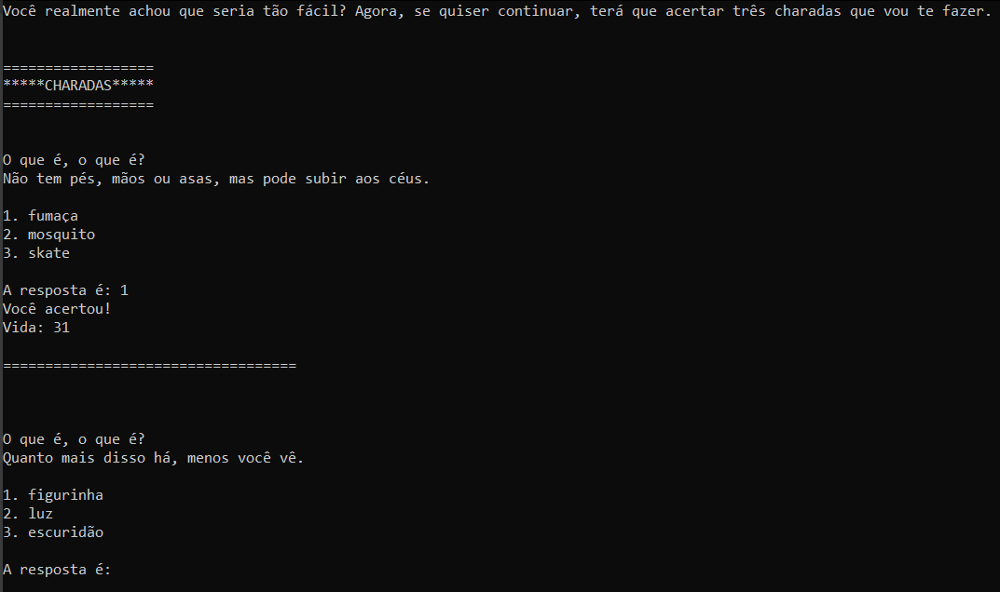

# Jogo RPG

Este é um pequeno jogo em C, ambientado no IDP, onde o jogador deve encontrar a chave do seu Peugeot 206 resolvendo desafios e evitando armadilhas em um ambiente escuro e misterioso.

## Objetivo

Você está preso dentro da faculdade após o expediente. Seu carro está no estacionamento, mas a chave desapareceu. Para escapar, você precisará explorar o local, evitar armadilhas, encontrar itens especiais e resolver charadas feitas por Nilson, o guardião da chave.

## Como compilar

Use `make` no terminal (requer `make` e `gcc` instalados):

```bash
make
````

Isso irá compilar o jogo e gerar um executável chamado `jogo`.

## Como jogar

Após compilar, execute o programa:

```bash
./jogo
```

Siga as instruções na tela e use seu raciocínio para vencer os desafios. Você perderá se sua vida chegar a zero ou se não resolver as charadas finais.

## Estrutura do projeto

* `jogo.c` – Código principal do jogo.
* `jogo.h` – Cabeçalhos e definições relacionadas ao jogo.
* `funcoes_auxiliares.h` – Funções auxiliares usadas no jogo.
* `funcoes_auxiliares.o` – Arquivo objeto das funções auxiliares.
* `Makefile` – Arquivo de automação para compilação.
* `.gitignore` – Arquivos a serem ignorados pelo Git.

## Capturas de tela







## Requisitos

* GCC (compilador C)
* Terminal com suporte a entrada/saída padrão

## Autor

* Gabriel Teles - <a href="https://github.com/QTelesGabriel">Github</a>